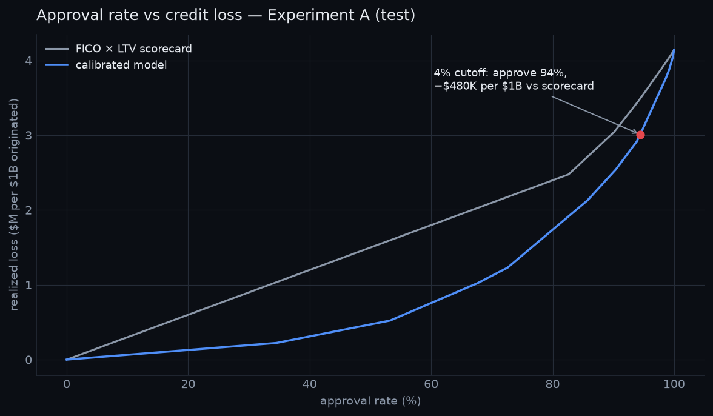
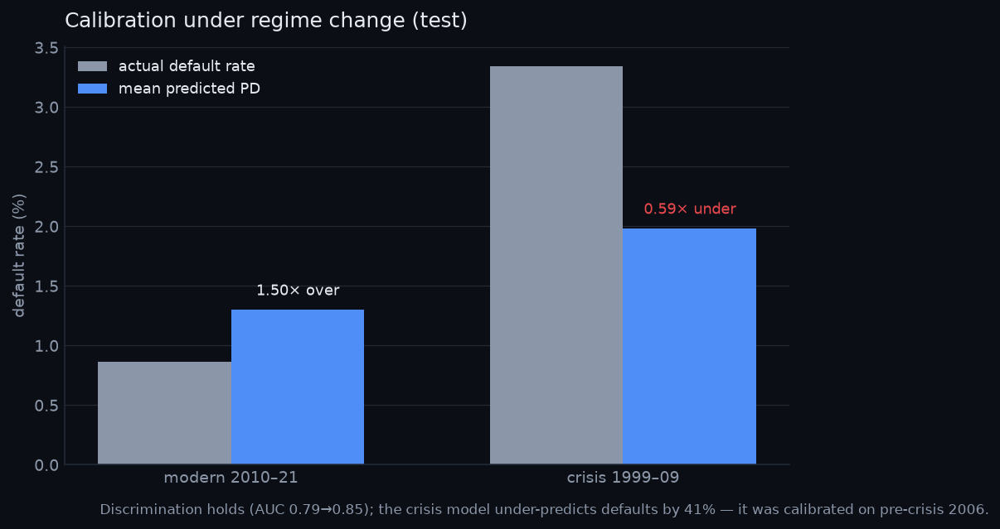

# Mortgage Default Risk — Calibrated Probabilities of Default

> Every number here is computed from real data — no placeholders (see PLAN.md).

**Live:** [dashboard](https://mortgage-default-risk.vercel.app) ·
[API docs](https://mortgage-default-risk-api.onrender.com/docs)

A credit-risk model that predicts probability of default (PD) on US mortgages, **calibrated**
so the probabilities are usable for loan pricing, plus a risk-desk dashboard where you drag
an approval cutoff and watch approval rate trade against expected loss in dollars.

**Headline number:** *At a 4% PD cutoff the calibrated model approves **94.4%** of
applications and reduces realized credit losses by **~$480K per $1B originated (13.7%)**
versus the FICO×LTV scorecard at the same approval rate* (Experiment A, test 2020–21;
empirical LGD 0.456).



## Why a vintage split (not random)

Loans are split by **origination vintage**, never randomly. A random split leaks the future
into the past: it lets the model train on 2019 loans to predict 2015 ones, and it inflates
metrics because economic conditions bleed across the split. Splitting by vintage mirrors how
a model is actually deployed — trained on history, scored on originations it has never seen.

## Data

Freddie Mac Single-Family Loan-Level **official sample** (~1.3M loans; 50k/year). The raw
data is **not** in this repo — the licence prohibits redistribution, so `data/` is
gitignored. See `scripts/download_instructions.md` to obtain it.

## Results

Experiment A (modern regime) — train 2010–17, validation 2018–19, **test 2020–21**
(n = 82,413, base default rate 0.87%):

| Model | AUC | KS | Brier |
|---|---|---|---|
| Scorecard (FICO × LTV) | 0.718 | 0.330 | 0.00857 |
| **Logistic regression** | **0.791** | **0.447** | 0.00859 |
| XGBoost (raw) | 0.751 | 0.384 | 0.05041 |
| XGBoost + isotonic calibration | 0.748 | 0.375 | 0.00869 |

**Finding, reported rather than tuned away:** on this strict vintage split, the regularized
logistic regression is the best discriminator. Gradient boosting beats the crude FICO×LTV
scorecard but does **not** beat the linear model — the 2017→2020 regime shift (and a
COVID-inflated 2019 validation base rate) rewards the smoother model, and XGBoost is not
tuned against the held-out test set to hide that.

**Calibration works as intended.** XGBoost trained with `scale_pos_weight` ranks well but
its raw probabilities are badly inflated (Brier 0.050). Isotonic regression fit on the
validation split alone cuts that to 0.0087 — an 83% reduction — bringing the probabilities
onto the diagonal (see `artifacts/reliability_curve_A.png`) so they can price a loan.

## Economics

Calibrated PDs turn into dollars: **EL = PD × LGD × EAD**, with EAD approximated by original
UPB. **LGD is empirical — 0.456** — the dollar-weighted realized loss over 15,130 disposed
defaulted loans (short sale / charge-off / REO), not an assumption. Sweeping the approval-PD
cutoff traces the approval-rate ↔ loss frontier above; the deployed calibrated model
(logistic + isotonic) dominates the FICO×LTV scorecard at every approval rate. The full
200-point sweep is precomputed to `artifacts/cutoff_curve_A.json` so the dashboard slider
is instant.

## Crisis stress test — model risk under regime change

Experiment B repeats everything on a crisis split: **train 1999–2005, validation 2006, test
2007–2009.** The result is more interesting than a simple "it degrades":



| | Modern (A) | Crisis (B) |
|---|---|---|
| Test base default rate | 0.87% | 3.34% |
| AUC | 0.789 | **0.854** |
| Mean predicted PD | 1.30% | 1.98% |
| **Predicted ÷ actual** | 1.50× (over) | **0.59× (under)** |

**Discrimination doesn't break — calibration does.** The model *ranks* crisis-era loans even
better than modern ones (AUC 0.85 vs 0.79): subprime loans were identifiably risky at
origination. But its **absolute probabilities are 41% too low** on 2007–2009, because it was
calibrated on pre-crisis 2006 and had never seen crisis-level default frequencies. A lender
pricing loans off those PDs would have systematically under-reserved heading into 2008.

That is the distinction a risk function is paid to make: a model can keep its rank-ordering
through a regime shift while its loss forecasts go badly wrong. Reported, not hidden — and
the reason the modern model here (A) over-predicts by 50% is the mirror image: it was
calibrated on the COVID-inflated 2019 vintage.

## API

FastAPI, Pydantic on every request/response, OpenAPI docs at `/docs`. Serves the committed
artifacts and the deployed calibrated-logistic model, so it answers even on a cold start.

| Endpoint | Returns |
|---|---|
| `GET /health` | Liveness (keep-warm target) |
| `GET /metrics` | AUC / KS / Brier per experiment and model |
| `GET /cutoff-curve?experiment=A` | The precomputed 200-point sweep |
| `POST /score` | Origination features in → calibrated PD, risk band, expected loss |
| `GET /vintage-performance` | Default rate by origination year |

**Live:** https://mortgage-default-risk-api.onrender.com/docs

```bash
make serve   # http://localhost:8000/docs
```

## Reproduce

```bash
make install
# obtain data — see scripts/download_instructions.md
make ingest label          # parse to parquet, build the 24-month default label
make experiments           # both experiments (modern + crisis) + all artifacts
make serve                 # API on :8000
```

Full build spec and phase plan: [PLAN.md](PLAN.md).
